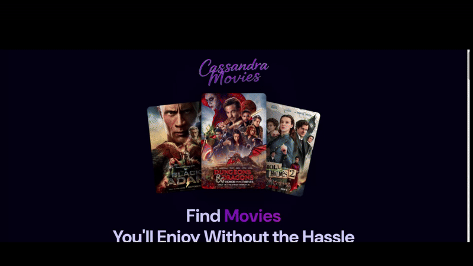

   # Movie App

   ## Description

   Movie App is a web application that allows users to search, view, and get information about movies. The application uses The Movie Database (TMDb) API to fetch movie data, including information about popular films, their details, cast, and reviews.

   📺 **Application Demo**




   ## Features

   - Search for movies by title.
   - View movie details, including description, rating, release date, and cast.
   - Display popular movies on the homepage.
   - Watch movie trailers.
   - Read reviews for movies.
   - Get movie recommendations based on viewed films.

   ## Technologies

   - **React**: A library for building user interfaces.
   - **React Router**: For managing routing in the application.
   - **Tailwind CSS**: A utility-first CSS framework for rapid UI development.
   - **Appwrite**: Backend as a service for data management and authentication.
   - **TMDb API**: API for fetching movie information.

   ## Installation

   1. Clone the repository:

      ```bash
      git clone https://github.com/your_username/your_repository.git
      ```

   2. Navigate to the project directory:

      ```bash
      cd your_repository
      ```

   3. Install dependencies:

      ```bash
      npm install
      ```

   4. Create a `.env.local` file in the root of the project and add your environment variables:

      ```plaintext
      VITE_TMDB_API_KEY=your_api_key
      VITE_APPWRITE_PROJECT_ID=your_project_id
      VITE_APPWRITE_DATABASE_ID=your_database_id
      VITE_APPWRITE_COLLECTION_ID=your_collection_id
      ```

   5. Run the application:

      ```bash
      npm run dev
      ```

   ## Usage

   - Open the application in your browser at `http://localhost:3000`.
   - Use the search bar to find movies.
   - Click on a movie to see its details, including the trailer and reviews.

   ## Screenshots

   
   

   ## License

   This project is licensed under the MIT License - see the [LICENSE](LICENSE) file for details.

   ## Contact

   If you have any questions or suggestions, feel free to reach out to me at: your_email@example.com.
